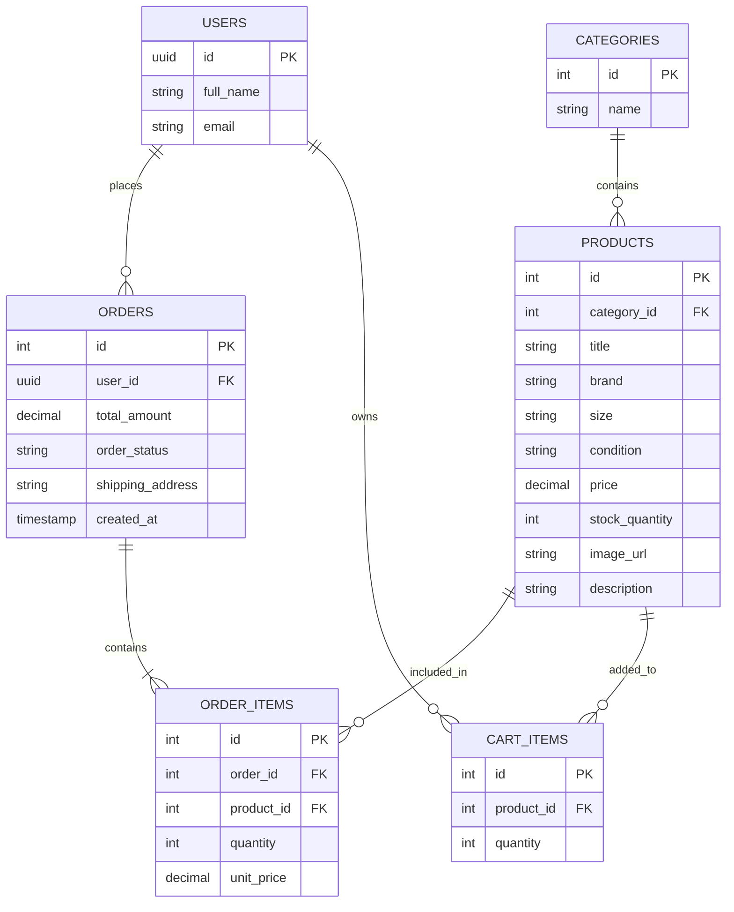

# Sprint 1: System Architecture & Scope Definition

## Project: Thrift Store

**Online Thrifted Apparel E-Commerce Platform**

**Technology:** HTML, CSS, JavaScript, Supabase (PostgreSQL, Auth, REST APIs)

---

## 1. Target Audience & Market Focus

### Target Users

Young people (16-25) who like wearing branded merchandise but can't pay full price, or simple people who want save money.

### Problem

In recent year the thrifted merchandise has skyrockted in popularity, People always loved wearing branded clothes but not everyone could afford them, and people used to be shy to use pre owned products. But as this year thanks to social media pre owned clothes not only got normalized but also became a trend. Influencers have been proudly show casing their thrifted mechandise. Which opens up the opportunity to start a thrifting business.

### Project Scope

The platform focuses exclusively on thrifted clothing (shoes are optional). The initial MVP will support single-piece inventory items, pre-owned condition ratings, and flexible payment gateways.

---

## 2. MVP Feature Scope

| Category | Feature | Description | Priority |
| --- | --- | --- | --- |
| **Authentication** | Registration & Login | Secure customer sign-up/login managed via Supabase Auth. | High |
| **Catalog & Condition** | Product Listings | Browse thrift items filtered by size, category, and item condition (*Brand New*, *As Good as New*, *Slightly Used*, *Used*). | High |
| **Cart & Stock** | Cart Management | Reserve unique single-item inventory in user cart during active sessions. | High |
| **Checkout & Gateway** | Flexible Payment Integration | Support multi-option checkout processing via **Stripe (Test Mode)**, **JazzCash / EasyPaisa** (One or Multiple may be integerated), or simulated Sandbox/COD options. | High |
| **Admin Management** | Inventory | Admin capability to upload unique pre-owned items, tag conditions, update stock| High |

---

## 3. Tech Stack

### Frontend: HTML, CSS, JavaScript (Vanilla)

Static web files hosted on modern edge CDN platforms (Netlify or Vercel). JavaScript handles dynamic DOM updates, cart state in `localStorage`, and asynchronous communication.

### Backend & Database: Supabase (PostgreSQL)

A Database-as-a-Service (BaaS) providing a managed PostgreSQL instance with built-in Authentication, Row-Level Security (RLS), and auto-generated REST APIs consumed directly via the client-side Supabase JS SDK.

### Payment Gateway Integrations

A modular payment engine configured to interface with client-side payment providers:

* **Stripe JS:** For card-based processing using test client keys and payment intents.
* **JazzCash / EasyPaisa / Mobile Wallet API (or Sandbox):** For local wallet number prompt, transaction reference submission, or mock manual verification.
(One or Multiple may be used)

## 4. System Architecture

```text
┌─────────────────────────────────────────────────────────┐
│                    CLIENT BROWSER                       │
│   HTML5 / CSS3 / Vanilla JavaScript (Frontend UI)        │
│              │
└───────────────┬─────────────────────────┬───────────────┘
                │                         │
     HTTPS REST │ SDK Calls     SDK / JS  │ Direct Tokenization
                ▼                         ▼
┌─────────────────────────┐   ┌───────────────────────────┐
│   SUPABASE PLATFORM     │   │   PAYMENT GATEWAYS        │
│ ┌─────────────────────┐ │   │ ┌───────────────────────┐ │
│ │ PostgreSQL Database │ │   │ │ Stripe (Test Mode)    │ │
│ ├─────────────────────┤ │   │ ├───────────────────────┤ │
│ │ Supabase Auth (JWT) │ │   │ │ JazzCash / EasyPaisa  │ │
│ └─────────────────────┘ │   │ └───────────────────────┘ │
└─────────────────────────┘   └───────────────────────────┘

```

---

## 5. Entity-Relationship Diagram (ERD)

### Main Relationships

* One user can place many orders.
* One user can have many cart items.
* One order can contain many products (via order items).
* One category can contain many products.



---

## 7. Conclusion

Sprint 1 lays out the foundational scope, modern serverless architecture, multi-gateway payment design, and PostgreSQL schema for **Thrift Store**. By utilizing Supabase alongside static HTML/CSS/JS hosting, the platform operates completely within free-tier capabilities while accommodating pre-owned clothing conditions.
